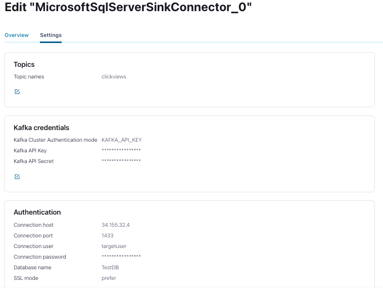
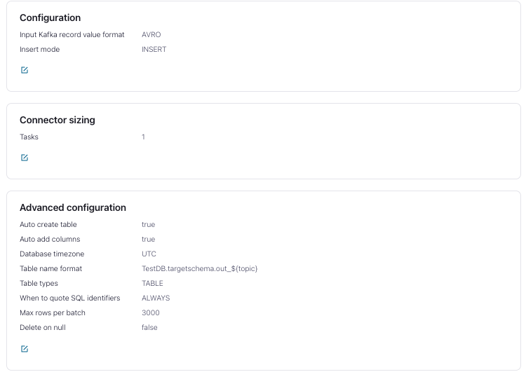

# On-cloud setup

## Why

To run SQL server sink as a managed connector in Confluent Cloud. 

## Pre Requisites

You'll need the following things installed on youre pc:

- Webbrowser
- A kubernetes instance connected to GCP, Azure or AWS


## Step 01 - Setup SQL Server under Kubernetes

To create a SQL Server instance for kubernetes execute the following command in the folder of this readme file:

```
$ kubectl apply -f k8s/sqlserver.yaml
```

Once this is started wait for the pod to be Ready. Use the following command:

```bash
$ kubectl get pods                            
NAME                                      READY   STATUS             RESTARTS         AGE
pod/mssql-deployment-xxxxxxxxxx-yyyyy     1/1     Running            0                27s
```

## Step 02 - execute SQL Statements

To execute the commands, you need to logon to your container

```bash
docker exec -it pod/mssql-deployment-xxxxxxxxxx-yyyyy  /bin/bash
```

Once you are on the server you can open a SQL command (the password is the one you added in your CRD Str0ngP!ssw0rd):

```bash
root@sqlserver:/# cd /opt/mssql-tools/bin/
root@sqlserver:/opt/mssql-tools/bin# ./sqlcmd -S localhost -U SA
Password: 
```

You can execute the sql commands as described [here](../shared/create-schema.sql)

## Step 03 - Generate data

In Confluent cloud, create a topic called `clickviews` and generate clickviews using the `Datatgen Source connector`.

[For more info click here](../using-datagen-connector.md)

## Step 04 - Get IP Adress

To get the IP Adress of your server do the following command:

```bash
% kubectl get all                            
NAME                                      READY   STATUS             RESTARTS         AGE
pod/mssql-deployment-6d858c8d57-tdzxd     1/1     Running            0                27s

NAME                            TYPE           CLUSTER-IP      EXTERNAL-IP   PORT(S)                               AGE                        12d
service/mssql-deployment        LoadBalancer   aaa.bbb.ccc.ddd     <pending>     1433:30466/TCP                        27s

NAME                                 READY   UP-TO-DATE   AVAILABLE   AGE
deployment.apps/mssql-deployment     1/1     1            1           28s

NAME                                            DESIRED   CURRENT   READY   AGE
replicaset.apps/mssql-deployment-6d858c8d57     1         1         1       28s

```

The ip adress is next to the Loadbalancer (replace by aaa.bbb.ccc.ddd)

## Step 05 - Run Connector

### Option 1 using the rest api

You can create the connector using the rest api. These are the options you will have to provide (replace what is needed):

```json
{
   "auto.create":"true",
   "auto.evolve":"true",
   "cloud.environment":"prod",
   "cloud.provider":"azure/gcp/aws",
   "connection.host":"aaa.bbb.ccc.ddd",
   "connection.password":"****************",
   "connection.port":"1433",
   "connection.user":"targetuser",
   "connector.class":"MicrosoftSqlServerSink",
   "db.name":"TestDB",
   "input.data.format":"AVRO",
   "kafka.api.key":"****************",
   "kafka.api.secret":"****************",
   "kafka.auth.mode":"KAFKA_API_KEY",
   "kafka.endpoint":"SASL_SSL://bootstrap-server",
   "kafka.region":"francecentral",
   "name":"MicrosoftSqlServerSinkConnector_0",
   "table.name.format":"TestDB.targetschema.out_${topic}",
   "tasks.max":"1",
   "topics":"clickviews"
 }
```


### Option 2 Using the GUI

If you use the GUI, these are te settings you'll have to chose:






