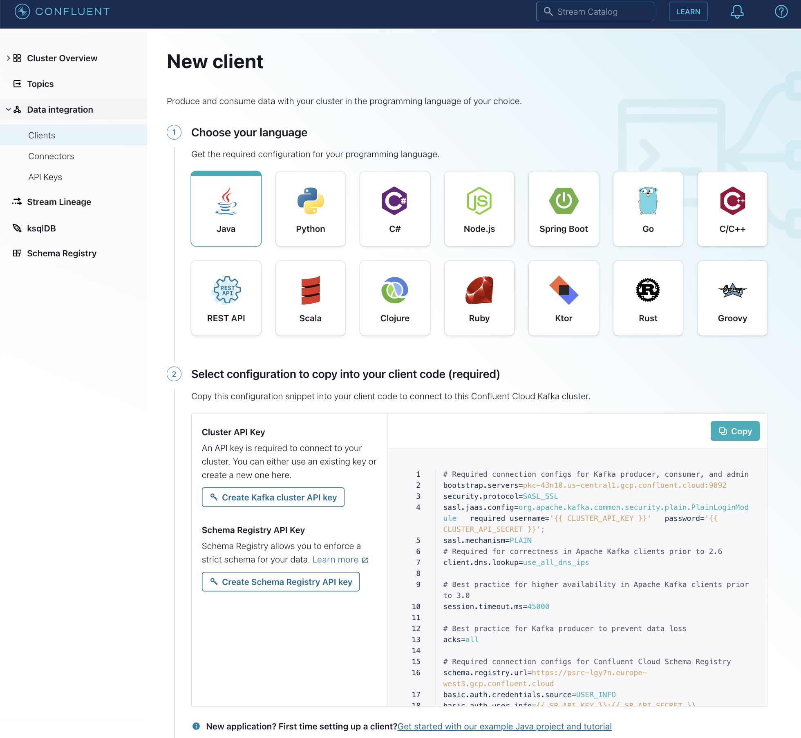

# On-premise setup

## Why

In order to build/run and debug the connectors yourself

## Pre Requisites

You'll need the following things installed on youre pc:

- Java 11
- maven
- Download latest [Confluent Kafka version](https://www.confluent.io/get-started/?product=software)
- Download source code of Kafka Connect JDBC (see further)
- Download latest SQL Server JDBC driver [from Microsoft](https://learn.microsoft.com/en-us/sql/connect/jdbc/microsoft-jdbc-driver-for-sql-server) or from the [maven repository - com.mircosoft.sqlserver/mssql-jdbc](https://mvnrepository.com/artifact/com.microsoft.sqlserver/mssql-jdbc)
- [Docker desktop](https://www.docker.com/products/docker-desktop/)

### Building and installing Kafka Connect JDBC

Get the latest version from git:

```bash
$ git clone git@github.com:confluentinc/kafka-connect-jdbc.git
```

You can build and compile this version with maven:

```bash
$ mvn clean install
```

## Step 01 - Confluent Cloud

Open Confluent Cloud and generate a new client:



You will also need to safe the 
- CLUSTER_API_KEY 
- CLUSTER_API_SECRET
- SR_API_KEY
- SR_API_SECRET
- BOOTSTRAP_SERVER
- SR_URL


## Step 02 - setup connector

[Background reading: setup a connector](https://docs.confluent.io/kafka-connectors/self-managed/userguide.html)

copy the files under the etc directory to {confluent install dir}/etc

And you will need to replace the values between `<<>>` with the new values.

## Step 03 - Copy JDBC library

Copy the downloaded microsoft jdbc library to {confluent install dir}/share/java/confluent-security/connect

## Step 04 - Generate data

In Confluent cloud, create a topic called `clickviews` and generate clickviews using the `Datatgen Source connector`.

[For more info click here](../using-datagen-connector.md)


## Step 05 - Start SQL Server

You can start a SQL Server instance through docker using the following command:

```bash
$ docker run -e 'ACCEPT_EULA=Y' -e 'SA_PASSWORD=Str0ngPa$$w0rd' -p 1433:1433 -d mcr.microsoft.com/mssql/server
```

## Step 06 - execute commands

To execute the commands, first look up what your containerid is:

```bash
$ docker ps
CONTAINER ID   IMAGE                            COMMAND                  CREATED          STATUS         PORTS                    NAMES
<<containerid>>   mcr.microsoft.com/mssql/server   "/opt/mssql/bin/nonr…"   10 seconds ago   Up 9 seconds   0.0.0.0:1433->1433/tcp   stoic_murdock
```

After you retrieved your containerid you can logon to the container:

```bash
docker exec -it <<containerid>>  /bin/bash
```

Once you are on the server you can open a SQL command (password in the password you added in your docker command under SA_PASSWORD):

```bash
root@sqlserver:/# cd /opt/mssql-tools/bin/
root@sqlserver:/opt/mssql-tools/bin# ./sqlcmd -S localhost -U SA
Password: 
```

You can execute the sql commands as described [here](../shared/create-schema.sql)

## Step 07 - Run the connector in standby mode

To run the connector in standalone mode execute the following command in the {confluent install dir}:


```bash
./bin/connect-standalone ./etc/connect-standalone.properties ./etc/sqlserver.sink.properties
```
