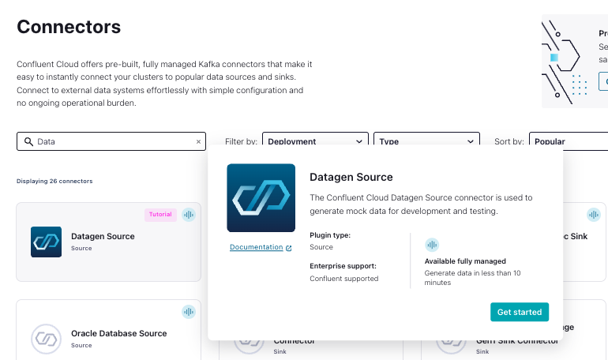
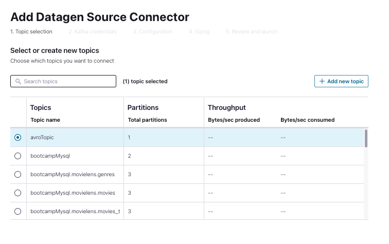
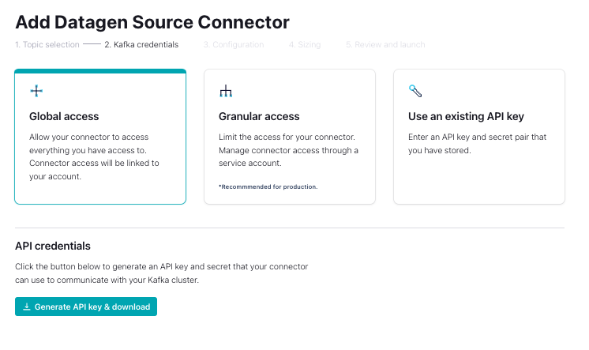
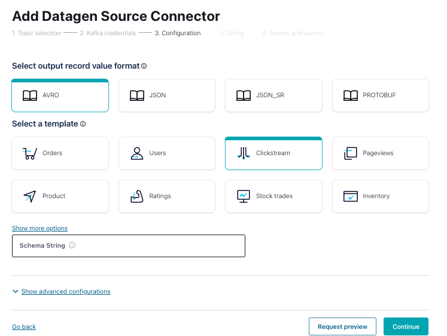

# Setup datagen connector on Confluent cloud

To setup the datagen connector go to the connect menu and select the datagen connector:

Then you need to select or create a source topic:

In the kafka credentials stap add the CLUSTER_API_KEY and CLUSTER_API_SECRET as provided in the previous step

and select AVRO and clickviews in the following step:

# Reference by

This page is reference by:

- [on confluent cloud](on-ccloud/README.md)
- [on premise](on-premise/README.md)